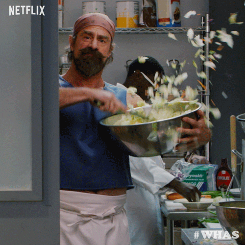

># Aziza Baccouri : Unemployed person

>***Greetings, world! I am Aziza, a true master of the art of unemployment. With my unwavering dedication to embracing leisure and my <u>uncanny</u> ability to find endless ways to avoid work, I have <u>perfected</u> the delicate balance between ambition and absolute indolence. While others may see unemployment as a setback, I see it as a <u>glorious</u> opportunity to explore the realms of creativity, self-discovery, and binge-watching my favorite TV shows. So, if you're ready to embark on an <u>extraordinary</u> journey through the land of unemployment, buckle up and join me on this <u>wonderful</u> escapade!***

>>## My SURPRISING Skills

1. **Professional Couch Potato :** As an expert in the field of laziness, I have honed my skills in achieving the perfect level of coziness on the couch. From mastering the art of Netflix marathons to discovering the most comfortable positions for extended periods of lounging, I am a true connoisseur of relaxation.

2. **Creative Excuse Inventor :** Need a brilliant excuse to get out of something? Look no further! I possess an uncanny ability to concoct the most imaginative and believable explanations for any situation. Whether it's avoiding social events or dodging responsibilities, I am a maestro in the art of creative alibis.

3. **Expert Snackologist :** Snacking is not just a pastime; it's an art form, and I am the reigning champion. With an extensive repertoire of snack combinations, I have acquired an impressive knowledge of the most delectable treats and their ideal pairings. From sweet to savory, I can guide you on a gastronomic journey that will leave your taste buds in awe.

>>## What I FUCKING like the most in this Fucking univers

- [x] Pajamas with Built-in Snack Pockets.

- [x] The Unexplained Phenomenon of Missing Socks.

- [ ] Wi-Fi That Never Betrays. ( Still in process10000 :weary: )

>>## The objectif that I want to achieve as a "developer" during Becode 

Create a Web App that Dispenses Unlimited <mark>Beers</mark>🍻 and <mark>Cesar salads</mark> 🥗. 
(I'm not kidding, dude. I love barley and chicken!)

>>## The Fears I have for sure 

Get a job. 

>>## The things I look forward to ? 

Don't know dude! I even don't know my plan of the day!

>>## The Three things you value the most to work as a team ? EASY and I explain even WHY:

1. A Bottomless Supply of Office Snacks.

2. The Power of Silly Team-Building Activities.

3. AfterWorks (~~Coffee~~ ➡ *Coffee free*)

|  A Bottomless Supply of Office Snacks    | The Power of Silly Team-Building Activities | AfterWorks |
| -----------------------------------------| ------------------------------------------- | ---------- |
| Inflation man                            | those moments (OR FULLDAY) when you don't have to pretend not to sleep                                  | Beers
| I would have Cesar salads at home (remember 😉)                                | nothing more to say                                       | exotic Cesar salads ( I admit that most of the time I am disappointed )

    

